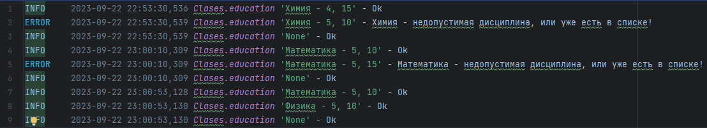
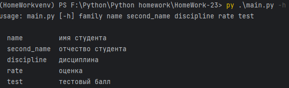

Задача о студентах. Логирование операции добавления дисциплин и сохранения данных в файл. 
Для логирования используется декоратор. Работа производиться ч/з командную строку. 

**Пример выполнения**

Вызов программы

Лог файл

Справка 

